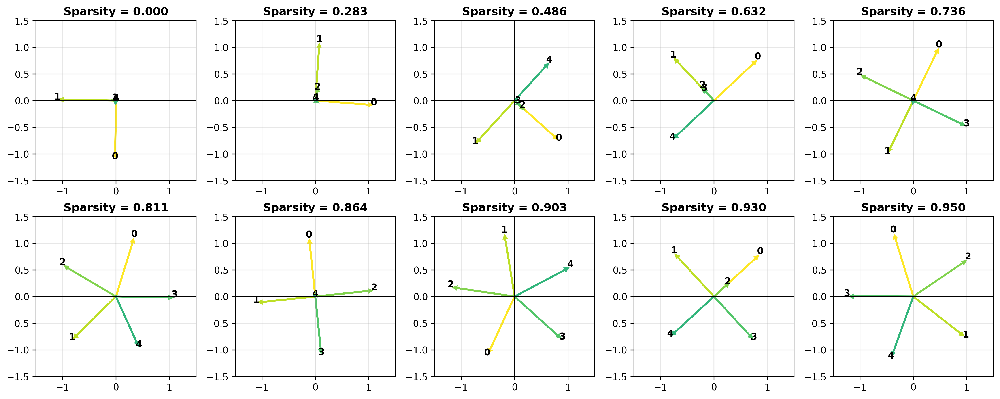
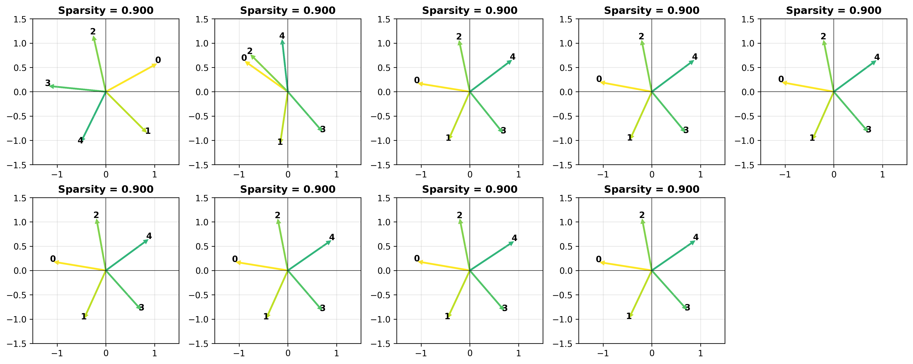

# Mech Interp

## Library Components

- `ToyModel` and `ParallelToyModel` from Toy Models of Superposition
- `SparseAutoencoder` with `ReLU`, `TopK` and `BatchTopK` variants  
  Uses `weight_norm` parameterisation on the decoder to avoid confusing the optimiser.  
  Experimental gaussian weight initialisation for uniform directions when normalised.  
- `geometric_median` using Weiszfeld algorithm for computing inital SAE bias
- `plot_feature_directions` plots 2-d feature directions to show 2-d superposition
- `SyntheticSparseDataGenerator` generates uniformily sparse feature vectors for training toy models 
- `SyntheticClusteredDataGenerator` generates feature vectors with controllable latent topic structure, loosely modelling feature relationships in language. For use in future experiments.

## [Scripts/Experiments](../../scripts/mech_interp/)

`train_toy_models_of_superposition.py` recreates the 5→2→5 experiment with varying sparsity using the `ParallelToyModel` for efficiency. Results:

`train_toy_model_for_sae.py` trains a 5→2→5 `ToyModel` with 0.9 sparsity to learn all 5 features in star superposition

`train_sae.py` trains an SAE to learn the feature directions from the activations of this toy model. I've had some successful runs with the `TopKSparseAutoencoder` (k=1). Example results:

This shows the target directions (first plot) followed by the learnt directions throughout training of a successful run.  
I found it's very sensitive to initialisation, with features often collapsing to the same directions. I'm keen to see if this sensitivity persists with larger models and more dimensions. 

There may be further experiments on this branch: 
